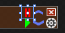

## A MVVM WPF News Ticker in C# ##

While preparing to work for a "real" WPF app I needed to teach myself MVVM. This project is the result of it. There are probably many different ways to achieve a similar result, so don´t take anything here for dogma.

> I ported the ticker to net core 3.0, to see what changes had to be made, in the end I just had to change trivial stuff but broke the .Net framework version in the process. The solution now has 2 projects, sadly the .Net framework one is **broken**... More to come as I sort it out!

#### Contents ####
- [The View - Model - Model View (MVVM) pattern](#MVVM)
- [The Ticker](#Ticker)
- [Binding to Allow for Dynamic Behavior](#Dynamic)
- [Binding Commands](#Commands)
- [Binding with Data Entry and Validation](#Validation)
- [Binding for Dynamic Content](#DynCont)
- [Debugging Bindings](#Debugging)

#### <a name="MVVM"/>The View - Model - Model View (MVVM) pattern ####

In short, this is a pattern that will segregate the "view" of an application (i. e. the user interface, UI) from the "model" (i. e. the business logic and its data).The _model_ and the _view_ are brought together by the "view model" component(s) which will expose / convert the data so the UI can represent it. (See [this Wikipedia article](https://en.wikipedia.org/wiki/Model%E2%80%93view%E2%80%93viewmodel) for an introduction to the pattern and [this blog post](https://blogs.msdn.microsoft.com/johngossman/2005/10/08/introduction-to-modelviewviewmodel-pattern-for-building-wpf-apps/) for the original introduction announcement from Microsoft)

The _model_ performs calculations, enforces rules, retrieves and saves data and maintains state.  The _view model_ binds data from the _model_ and commands from the _view_, the _view_ just displays and offers UI elements for the user interaction.

Microsoft´s schematic view of this (as seen in this [introduction to implementing MVVM in WPF](https://docs.microsoft.com/en-us/previous-versions/msp-n-p/ff798384(v=pandp.10)) is


WPF (the Windows Presentation Foundation) is well suited for this pattern since it offers extensive [data binding](https://docs.microsoft.com/en-us/dotnet/framework/wpf/data/data-binding-overview?view=netframework-4.8) capabilities. This allows the UI to react to changes in the underlying data (through the bindings) in order to refresh content, change its appearance or send back user input data to the model. Any UI element´s [attached property](https://docs.microsoft.com/en-us/dotnet/framework/wpf/advanced/attached-properties-overview) can be bound.

#### <a name="Ticker"/> The Ticker ####


The news ticker will periodically fetch headlines from [Hacker News](https://news.ycombinator.com/news) using its [API](https://github.com/HackerNews/API), from a select group of [reddit communities](https://www.reddit.com/) via [RSS](https://www.reddit.com/wiki/rss) and from [BBCNews](https://www.bbc.com/news), also via [its RSS service](https://www.bbc.com/news/10628494).

A schematic view of the project can be found [here](AdditionalFiles/SchematicView.md).

The headlines are displayed as buttons scrolling across the screen. When clicked, the corresponding page is displayed in your default browser. For Hacker News, a right click will display the item´s discussion page. On the right, a few buttons allow for some control: pause, resume, accelerate and slow down the scrolling, configuration and an exit button.

#### <a name="Dynamic"/> Binding to Allow for Dynamic Behavior ####

The scrolling (and the refreshing of data) can be paused using a button on the UI. The button will only display if there are headlines to show, and if the display isn´t paused already:



It is defined in XAML as:
```XML.xaml
<Button x:Name="btnPause" Visibility="{Binding ShowPauseButton}" Width="16" Height="16" Background="#00DDDDDD" HorizontalAlignment="Right" VerticalAlignment="Top" Canvas.Top="1" Canvas.Right="32" Margin="0,0,0,0" BorderBrush="{x:Null}" ToolTip="Pause" Command="{Binding ButtonPauseCommand}" BorderThickness="0">
            <StackPanel Orientation="Horizontal">
                <Image Source="Images/Pause_Red_LT_16X.png"/>
            </StackPanel>
</Button>
```
The `Visibility="{Binding ShowPauseButton}"` part binds the button´s visibility to a specific variable (`ShowPauseButton`) within the _view model_.

The location of the variable is defined by adding

```C#
            TVM = new TickerViewModel();            
            DataContext = TVM;
```
to the window´s constructor: `TVM` is a class containing, among other things, the variable `ShowPauseButton` that controls the visibility, based on internal logic. The element´s `DataContext` holds the source data for all bindings.

> :warning: One of the most annoying aspects of WPF is the fact that you use `strings` to define bindings. Visual Studio´s IntelliSense does not offer any help when working on bindings in XAML, neither is any error or warning displayed if a binding is not found. It´s really easy to misspell something (for example "ShowPauseButton" above) and wonder while your binding doesn´t work.

The initialization of the `DataContext` could also be performed from XAML but I prefer to do this in the (practically empty!) code behind file...

Notice that I defined a `DataContext` for the whole window (and it will be inherited by all its elements), but it can also be defined for specific UI elements. For a simple app like this I kept everything within one class.

Notice also that for the above binding to work, the variable `ShowPauseButton` must be of type `System.Windows.Visibility`. WPF offers a handy way of [converting](https://docs.microsoft.com/en-us/dotnet/framework/wpf/data/data-binding-overview?view=netframework-4.8#data-conversion) data by implementing the [IValueConverter interface](https://docs.microsoft.com/en-us/dotnet/api/system.windows.data.ivalueconverter?view=netframework-4.8) for use in bindings. You could, for example, convert a `bool` value to a `Visibility` (there´s actually a [built-in converter](https://docs.microsoft.com/en-us/dotnet/api/system.windows.controls.booleantovisibilityconverter?redirectedfrom=MSDN&view=netframework-4.8) to do this), a `string` to a `double` etc. In the app I didn´t use this capability to keep things simpler.

In order for runtime changes to a bound property to be noticed by the control, a class implementing the [`INotifyPropertyChanged`](https://docs.microsoft.com/en-us/dotnet/api/system.componentmodel.inotifypropertychanged.propertychanged?view=netframework-4.8) interface must be used, for example:
```C#
    public class BaseViewModel : INotifyPropertyChanged, IDisposable
    {
      public event PropertyChangedEventHandler PropertyChanged;

      [...]
          internal void NotifyPropertyChanged([CallerMemberName] string propertyName = "")
          {
              PropertyChanged?.Invoke(this, new PropertyChangedEventArgs(propertyName));
          }

          [...]

          public Visibility ShowPauseButton
          {
              get => showPauseButton;
              set
              {
                  if (showPauseButton != value)
                  {
                      showPauseButton = value;
                      NotifyPropertyChanged();
                  }
              }
          }

          [...]
```
Here a generic `PropertyChangedEventHandler` is defined that can be used for any property. The property´s name is passed due to the [`[CallerMemberName]` attribute](https://docs.microsoft.com/en-us/dotnet/api/system.runtime.compilerservices.callermembernameattribute?view=netframework-4.8). Whenever the variable `ShowPauseButton` changes its value, a call to `NotifypropertyChanged()` will trigger an event containing the name of the changed variable, so the UI can update itself.

#### <a name="Commands"/> Binding Commands ####

In the XAML definition of the pause `Button`
```XML.xaml
<Button x:Name="btnPause" Visibility="{Binding ShowPauseButton}" Width="16" Height="16" Background="#00DDDDDD" HorizontalAlignment="Right" VerticalAlignment="Top" Canvas.Top="1" Canvas.Right="32" Margin="0,0,0,0" BorderBrush="{x:Null}" ToolTip="Pause" Command="{Binding ButtonPauseCommand}" BorderThickness="0">
            <StackPanel Orientation="Horizontal">
                <Image Source="Images/Pause_Red_LT_16X.png"/>
            </StackPanel>
</Button>
```
the `Command="{Binding ButtonPauseCommand}"` part defines what happens when the button is clicked.

The `ButtonPauseCommand` points to an object implementing the [`ICommand Interface`](https://docs.microsoft.com/en-us/dotnet/api/system.windows.input.icommand?view=netframework-4.8):

```C#
ICommand ButtonPauseCommand = new RelayCommand(param => PauseButtonClick(), param => CanPause);
```

`PauseButtonClick()` is just a simple function:

```C#
        private void PauseButtonClick()
        {
            animateOn = false;
            CanPause = false;
            ShowPauseButton = Visibility.Hidden;
            ShowResumeButton = Visibility.Visible;
            contentHandler.PauseRefresh();
        }
```
It will set some variables and command the underlying service to stop fetching headlines.

The real legwork happens in the `RelayCommand` class (from Josh Smith´s [Patterns - WPF Apps With The Model-View-ViewModel Design Pattern](https://msdn.microsoft.com/en-us/magazine/dd419663.aspx)). Instead of creating a full implementation of `ICommand` for every command we need, this class will implement it just once and generate our different commands´ logics. It is defined as:
```C#
    class RelayCommand : ICommand
    {        
        private readonly Action<object> _execute;
        private readonly Predicate<object> _canExecute;

        public RelayCommand(Action<object> execute, Predicate<object> canExecute = null)
        {
            _execute = execute ?? throw new ArgumentNullException(nameof(execute));
            _canExecute = canExecute;
        }

        public bool CanExecute(object parameter)
        {
            return _canExecute == null ? true : _canExecute(parameter);
        }

        public event EventHandler CanExecuteChanged
        {
            add { CommandManager.RequerySuggested += value; }
            remove { CommandManager.RequerySuggested -= value; }
        }

        public void Execute(object parameter)
        {
            _execute(parameter ?? "<N/A>");
        }
    }
```
It´s constructor takes the function as the first argument. The second argument can point to a method defining if the function can be executed at any specific time.

In the case of the pause button it points to a `bool` value defining if there are items being scrolled.

#### <a name="Validation"/> Binding with Data Entry and Validation ####

A user-editable field in the UI that needs validation can also be handled through bindings. The news ticker has a window with configuration options, one of them expecting a numerical value.


It is defined in XAML as

```XML.xaml
      <TextBox x:Name="refreshBox" HorizontalAlignment="Left" Height="25" Margin="181,33,0,0" TextWrapping="Wrap"  VerticalAlignment="Top" Width="38" HorizontalContentAlignment="Center" VerticalContentAlignment="Center" ToolTip="{x:Static localization:Resources.RefreshToolTip}">
            <TextBox.Text>
                <Binding Path="NetworkRefresh" Mode="TwoWay" UpdateSourceTrigger="PropertyChanged">
                    <Binding.ValidationRules>
                        <ExceptionValidationRule/>
                    </Binding.ValidationRules>
                </Binding>
            </TextBox.Text>
        </TextBox>
```
Within the `Binding` declaration there is the `UpdateSourceTrigger` value, which determines when the underlying variable gets updated. `PropertyChanged` will trigger the update (and the validation) at each user input. Details and other possibilities are described in the docs for the [`UpdateSourceTrigger enum`](https://docs.microsoft.com/en-us/dotnet/api/system.windows.data.updatesourcetrigger?view=netframework-4.8).

The `Mode="TwoWay"` part makes the binding work in both directions: a change in the underlying property is shown in the UI, and a change to the field in the UI is sent back to the variable.

The `Binding.ValidationRules` determine which rule to use. In the above code snippet the built-in `ExceptionValidationRule` is used: whenever the validation throws an exception, the `TextBox` will change its appearance (by default receiving a red margin). You can define your own [`ValidationRule`](https://docs.microsoft.com/en-us/dotnet/api/system.windows.controls.validationrule?view=netframework-4.8) if needed, for example to check for valid numeric or date ranges. Custom UI changes to the element can be defined in a [`Validation.ErrorTemplate`](https://docs.microsoft.com/en-us/dotnet/api/system.windows.controls.validation.errortemplate?view=netframework-4.8). (Microsoft has a simple, full [example on Github](https://github.com/Microsoft/WPF-Samples/tree/master/Data%20Binding/BindValidation) showing such a template)

The variable `NetworkRefresh` is defined as a `string`, backed by a `double`:
```C#
        public string NetworkRefresh
        {
            get => refresh.ToString("N1", System.Globalization.CultureInfo.CurrentCulture);

            set
            {
                if (double.TryParse(value, System.Globalization.NumberStyles.Float, System.Globalization.CultureInfo.CurrentCulture, out double refr))
                {
                    refresh = refr;
                    NotifyPropertyChanged();
                }
                else
                {
                    throw new ApplicationException(Properties.Resources.ErrorMustBeNumeric);

                }
            }
        }
```
Notice that the setter throws an `Exception` if the parsing of the `string` to a `double` does not work, signaling the UI to notify the user.

#### <a name="DynCont"/> Binding for Dynamic Content ####

The ticker displays the headlines within a `Canvas`, as a series of `Button` elements. These scroll across the screen, from right to left in the current implementation. The underlying news service will refresh the headlines periodically and this needs to be reflected in the UI.

In order to achieve this, the buttons are created programmatically beforehand and their `Content` property is bound to a [`ObservableCollection<string>`](https://docs.microsoft.com/en-us/dotnet/api/system.collections.objectmodel.observablecollection-1?view=netframework-4.8), which takes care of signaling the UI any time an object is added or modified.

```C#
private var headlines = new ObservableCollection<string>();
public ObservableCollection<string> Headlines => headlines;
[...]
            Button but;
            for(int i = 1; i < numberOfButtons; i++)
            {                
                headlines.Add(string.Empty);                
                but = new Button() { Width = buttonWidth, Height = 30, Background = Brushes.LightBlue, Name = "B1" };

                var contentBinding = new Binding($"Headlines[{i}]") { Mode = BindingMode.OneWay };
                but.SetBinding(Button.ContentProperty, contentBinding);

                NewsButtons.Add(but);
            }      
```
Initially, the headlines are created with a `string.Empty` `Content`. After refresh, the different string values are updated and automatically reflected in the button´s text, thanks to the magic of binding.

The binding is defined via `contentBinding = new Binding($"Headlines[{i}]") { Mode = BindingMode.OneWay };`: each button binds to a specific item in the Headlines list (Headlines[i]).

> :warning: Notice again the use of a `string` to define a binding. Beware of misspellings!

The `Mode = BindingMode.OneWay` part defines the binding to be *from* the data source *to* the UI. Any change within the UI does not reflect back to the data. See the docs for the [BindingMode enum](https://docs.microsoft.com/en-us/dotnet/api/system.windows.data.bindingmode?view=netframework-4.8) for more options.

The animation (scrolling) is achieved by binding the buttons `Canvas.LeftProperty` to an `ObservableCollection<double>`. This collection is updated several times a second in its own thread.

> :white_check_mark: Notice that one of the "hidden" advantages of using data binding is that you can change a UI element´s content or characteristics from a thread that is *not* the UI thread without cumbersome `BeginInvokes` to the UI `Dispatcher` by working on the data sources instead !

#### <a name="Debugging"/> Debugging Bindings ####

If using Visual Studio, you can [enable tracing for WPF](https://docs.microsoft.com/en-us/visualstudio/debugger/how-to-display-wpf-trace-information?view=vs-2019) and your Output window will show details of what´s going on behind the scenes. You can choose what level of information is displayed. The slight disadvantage is that *all* or *no* bindings are traced, so if you want full details, you´ll get a lot of text to wade through.

If you want to trace a specific binding with all its gory details, you use the above configuration to choose a low level of detail for all, then you include the following snippet in your XAML:
```XML.xaml
<Window
    [...]
    xmlns:diag="clr-namespace:System.Diagnostics;assembly=WindowsBase"
    [...]
</Window>
```
Within the `Binding` you´re interested in you do
```XML.xaml
    <Binding diag:PresentationTraceSources.Tracelevel=High [...] />
```

Alternatively, you can achieve the same in code:
```C#
Binding bind = new Binding() { [...]  };
System.Diagnostics.PresentationTraceSources.SetTraceLevel(bind, System.Diagnostics.PresentationTraceLevel.High);
```
The Output window in Visual Studio will display the details of the binding as they happen (errors and more).
